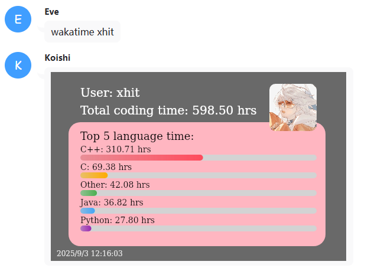

# koishi-plugin-wakaview

[](https://koishi.chat)
[](https://www.npmjs.com/package/koishi-plugin-wakaview)

## 📖 简介

**wakaview** 是一个适用于 [Koishi](https://koishi.chat) 的插件，可以查询指定用户的 [WakaTime](https://wakatime.com) 编程统计数据，并以 **可视化图片** 的形式展示，包括：

- ✅ 总编码时长  
- ✅ Top 5 常用语言及其使用时长  
- ✅ 自动生成语言条形图  
- ✅ 展示用户头像  
- ✅ 带有时间戳水印  

效果示例：

>

---

## 📦 安装

在 Koishi 插件市场中搜索 `wakaview` 并安装，或者使用 `npm` / `yarn` 安装：

```bash
# 使用 npm
npm install koishi-plugin-wakaview

# 使用 yarn
yarn add koishi-plugin-wakaview
```
---

## 🚀 使用方法

在聊天中输入以下指令：
```bash
/wakatime <username>
```

- <username> 为 WakaTime 用户名（注意不是邮箱）。

- 插件会调用 WakaTime 的公开 API，生成一张包含统计信息的图片并发送到群聊/私聊。

示例：

```bash
/wakatime demoUser
```
## ⚙️ 功能细节

---

- 数据来源：https://wakatime.com/api/v1/users/{username}/stats

- 绘图引擎：@napi-rs/canvas

- 字体支持：支持自定义字体（assets/fonts/VarelaRound-Regular.ttf），不存在则回退到系统字体

- 图像内容：

  - 用户名 & 总时长（小时）

  - Top 5 语言及条形图

  - 用户头像（自动获取）

  - 当前时间水印  

---

## ❗ 注意事项

- WakaTime 用户必须公开数据，否则 API 返回为空。

- 如果遇到 获取 Wakatime 数据失败，请检查用户名是否正确，或稍后重试。

-  使用时建议保证网络能够访问 wakatime.com 及头像 URL。
